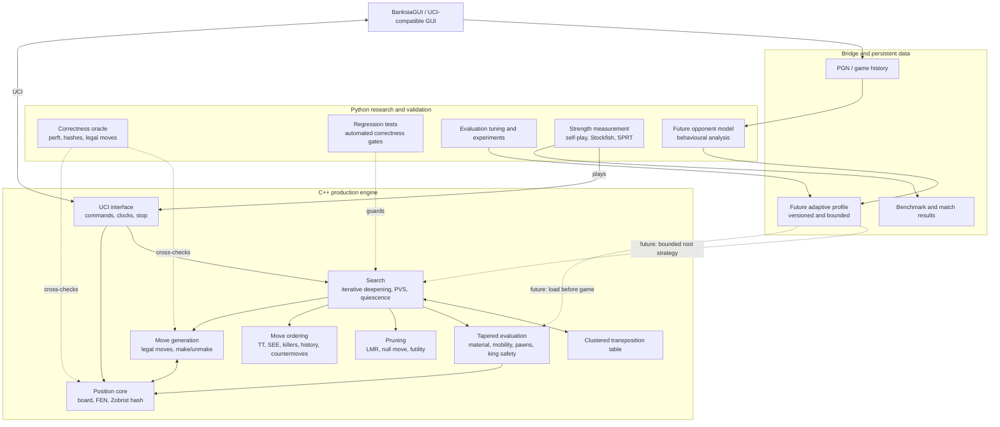

# Adaptive Chess Engine Architecture

This project uses a hybrid architecture. C++ owns the performance-critical
playing engine, while Python remains the independent correctness oracle,
measurement environment, tuning system, and future opponent-modelling layer.

## System architecture

Python will not be called at every search node. Python will learn and export a
small, validated profile; C++ will apply its bounded parameters without adding
inter-process overhead to the search tree.

## Current responsibility boundaries

| Area | Implementation | Status |
|---|---|---|
| GUI communication | C++ UCI executable | Playable in BanksiaGUI |
| Position and chess rules | C++ production core | Perft and oracle checked |
| Search | C++ | PVS, quiescence and iterative deepening |
| Search efficiency | C++ | TT, SEE, ordering, LMR, null move and futility |
| Time management | C++ | Clocks, increments, limits and asynchronous stop |
| Correctness oracle | Python | Legal-move, hash, perft and regression checks |
| Strength measurement | C++ and Python | Self-play, SPRT and Stockfish gauntlets |
| Evaluation research | Python | Experiments and future automated tuning |
| Opponent modelling | Python | Planned |
| Adaptive profile execution | C++ | Planned |

## Current limitations

1. **Allocation-heavy move generation.** Search creates dynamic move vectors,
   and the C++ legal generator still relies on make/check/unmake filtering in
   places where direct checker and pin masks would be faster.
2. **Procedural sliding attacks.** Bishops, rooks, and queens scan rays instead
   of using magic bitboards, PEXT, or occupancy lookup tables.
3. **Non-incremental evaluation work.** Material, game phase, piece-square
   values, and several positional features are recalculated at leaf positions.
4. **Limited positional knowledge.** Threats, outposts, space, weak squares,
   king attack zones, safe checks, and specialized endgames need expansion.
5. **Pruning validation scale.** Current reference comparisons pass, but LMR,
   null-move, and futility logic need much larger randomized and tactical sets.
6. **Preliminary strength baseline.** The first 78-game gauntlet estimates 1871
   on Stockfish 18's limited-strength scale, with an approximate 1792-1949
   interval; it is not a FIDE or online-platform rating.
7. **Single-threaded search.** Lazy SMP and a UCI `Threads` option are not yet
   implemented.
8. **No adaptive bridge yet.** Python does not yet export an opponent profile
   that the C++ engine can validate and load.

## Road to the adaptive layer

### Acceptance principle

The adaptive layer begins only after the neutral engine is stable enough to
separate real behavioural adaptation from ordinary engine defects. Every
adaptive change must remain bounded, preserve chess legality, retain a neutral
fallback, and demonstrate value through color-swapped candidate-versus-neutral
SPRT matches.

