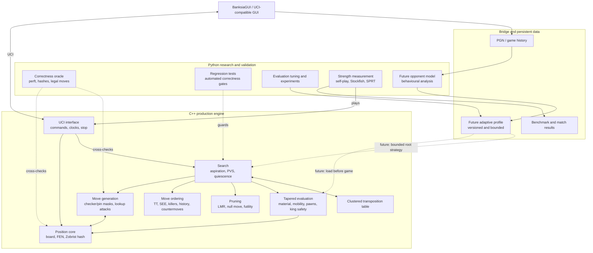

# Adaptive Chess Engine Architecture

This project uses a hybrid architecture. C++ owns the performance-critical
playing engine, while Python remains the independent correctness oracle,
measurement environment, tuning system, and future opponent-modelling layer.

## System architecture

Python will not be called at every search node. Python will learn and export a
small, validated profile; C++ will apply its bounded parameters without adding
inter-process overhead to the search tree.

## Current responsibility boundaries

| Area | Implementation | Status |
|---|---|---|
| GUI communication | C++ UCI executable | Playable in BanksiaGUI |
| Position and chess rules | C++ production core | Direct legality, perft and oracle checked |
| Search | C++ | Aspiration windows, PVS, quiescence and iterative deepening |
| Search efficiency | C++ | TT, SEE, ordering, LMR, null move and futility |
| Sliding attacks | C++ | Occupancy-indexed lookup tables used by generation, SEE and mobility |
| Recursive move storage | C++ | Fixed-capacity move lists and PV lines |
| Base evaluation state | C++ | Incremental material, placement, bishop counts and phase |
| Time management | C++ | Clocks, increments, limits and asynchronous stop |
| Correctness oracle | Python | Legal-move, hash, perft and regression checks |
| Strength measurement | C++ and Python | Self-play, SPRT and Stockfish gauntlets |
| Evaluation research | Python | Experiments and future automated tuning |
| Opponent modelling | Python | Planned |
| Adaptive profile execution | C++ | Planned |

## Current limitations

1. **Partially dynamic evaluation.** Material, placement, bishop counts, and
   phase are incremental, but pawn structure, mobility, rook files, and king
   safety are still calculated at leaves because they depend on wider geometry.
2. **Limited positional knowledge.** Threats, outposts, space, weak squares,
   king attack zones, safe checks, and specialized endgames need expansion.
3. **Pruning validation scale.** Current reference comparisons pass, but LMR,
   null-move, and futility logic need much larger randomized and tactical sets.
4. **Preliminary strength baseline.** The first 78-game gauntlet estimates 1871
   on Stockfish 18's limited-strength scale, with an approximate 1792-1949
   interval; it is not a FIDE or online-platform rating.
5. **Single-threaded search.** Lazy SMP and a UCI `Threads` option are not yet
   implemented.
6. **No adaptive bridge yet.** Python does not yet export an opponent profile
   that the C++ engine can validate and load.

## Road to the adaptive layer

```mermaid
flowchart LR
    A["Completed: direct legality,<br/>lookups, move stacks"]
    B["Completed: incremental base<br/>evaluation and aspiration"]
    D["Broader tactical and<br/>pruning validation"]
    E["Stronger neutral<br/>evaluation"]
    F["500+ game<br/>multi-engine baseline"]
    G["Versioned adaptive<br/>profile schema"]
    H["Python analysis and<br/>C++ profile loader"]
    I["Opponent<br/>modelling"]
    J["Adaptive versus neutral<br/>SPRT validation"]

    A --> B --> D --> E --> F --> G --> H --> I --> J
```

### Acceptance principle

The adaptive layer begins only after the neutral engine is stable enough to
separate real behavioural adaptation from ordinary engine defects. Every
adaptive change must remain bounded, preserve chess legality, retain a neutral
fallback, and demonstrate value through color-swapped candidate-versus-neutral
SPRT matches.
